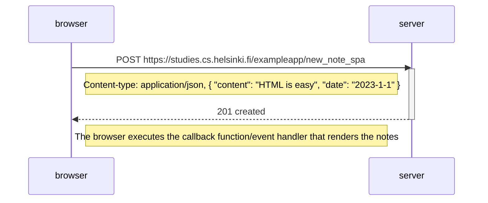

```mermaid
sequenceDiagram
    participant browser
    participant server

    browser->>server: POST https://studies.cs.helsinki.fi/exampleapp/new_note_spa
    activate server
    Note right of browser: Content-type: application/json, { "content": "HTML is easy", "date": "2023-1-1" }

    server-->>browser: 201 created
    deactivate server

    Note right of browser: The browser executes the callback function/event handler that renders the notes

```